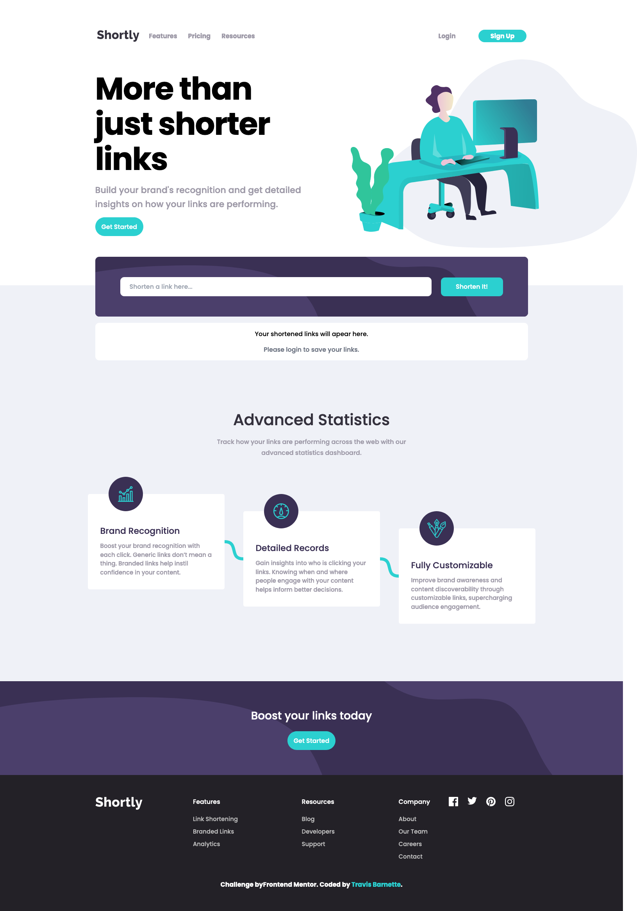
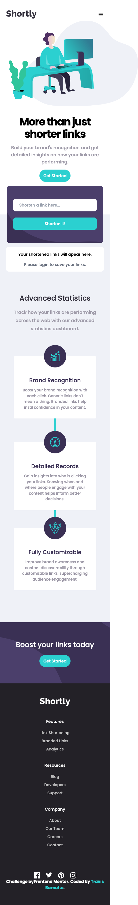

# Frontend Mentor - Shortly URL shortening API Challenge solution

This is a solution to the [Shortly URL shortening API Challenge challenge on Frontend Mentor](https://www.frontendmentor.io/challenges/url-shortening-api-landing-page-2ce3ob-G). Frontend Mentor challenges help you improve your coding skills by building realistic projects. 

## Table of contents

- [Overview](#overview)
  - [The challenge](#the-challenge)
  - [Screenshot](#screenshot)
  - [Links](#links)
- [My process](#my-process)
  - [Built with](#built-with)
  - [What I learned](#what-i-learned)
  - [Continued development](#continued-development)
  - [Useful resources](#useful-resources)
- [Author](#author)

## Overview
This is my shortly recreation! I decided to use tailwind and react for the front end development of this project and REALLY challenge myself with some firebase integrations for maintaining user state!

### The challenge

Users should be able to:

- View the optimal layout for the site depending on their device's screen size
- Shorten any valid URL
- See a list of their shortened links, even after refreshing the browser
- Copy the shortened link to their clipboard in a single click
- Receive an error message when the `form` is submitted if:
  - The `input` field is empty

### Screenshot

Desktop: 
Mobile: 

### Links

- Solution URL: [github-repo](https://github.com/barnettet31/url-shortener-fem)
- Live Site URL: [firebaseapp](https://url-shorty-fem.web.app/)

## My process
Started out getting the proper behaviors and ui down pat then dug into the more complicated bits...the firebase was a real challenge and I spent a couple weeks snuggled up to the docs for that! 

### Built with

- Semantic HTML5 markup
- CSS custom properties
- Flexbox
- CSS Grid
- Mobile-first workflow
- [React](https://reactjs.org/) - JS library
- [TailwindCSS](https://tailwindcss.com/) - For styles
- [Firebase](https://firebase.google.com/) - For backend management

### What I learned

This project I really tried to push myself by adding both authentication AND a database in the background, which meant that I needed to do more than just persist the users shortened links in the local storage! I found it particularly difficult learning what exactly Firebase types were all about and how to handle them in my components.

I added a couple of placeholder pages to kinda make the site not be alive but also just to have a little fun haha

I think the one part that I would change if I could would be the lines on the statistics section on the main page, unfortunately I couldn't figure out how to do connecting svg lines myself manually so I ended up using a react library to handle it. That ended with the lines essentially being squiggles instead of the direct lines...which I kinda feel looks better?

Let me know what you all think and tell me if there are better practices than the ones I used because I would love to learn!

### Continued development

Moving forward I would really like to start looking at state management systems as handling things with context does not seem to be the industry standard! I plan on using jotai? I think that's the name of the state engine! And probably learning Redux by necessity! Also I would like to start using a react framework like next.js! 

### Useful resources

- [React Beta Docs](https://beta.reactjs.org/) - This really helped me move forward with react, they are so much better than the normal react docs. Well worth the read

## Author

- Website (Blog Post) - [travcodez](https://www.travcodez.com)
- Frontend Mentor - [@barnettet31](https://www.frontendmentor.io/profile/barnettet31)
- LinkedIN - [barnettetravis31](https://www.linkedin.com/in/barnettetravis31/)
